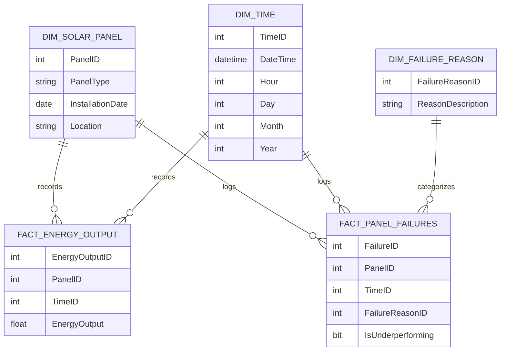

# Data Model Design Document for Solar Panel BI Dashboard

## Standards

Data Modeling: IEC 61970 for Energy Management System Integration, Data Models: Logical Semantic Data Model with fact and dimension tables to be deployed to Azure Synapse Analytics dedicated pool.

## LogicalDataModel

The logical data model is designed to support the interactive BI Dashboard for analyzing solar panel data. It includes fact tables for recording energy outputs and events, and dimension tables for solar panel attributes, time, and failure reasons.

## FactTables

- {'TableName': 'FACT_ENERGY_OUTPUT', 'Fields': [{'FieldName': 'EnergyOutputID', 'DataType': 'INT', 'IsPrimaryKey': True, 'IsForeignKey': False}, {'FieldName': 'PanelID', 'DataType': 'INT', 'IsPrimaryKey': False, 'IsForeignKey': True}, {'FieldName': 'TimeID', 'DataType': 'INT', 'IsPrimaryKey': False, 'IsForeignKey': True}, {'FieldName': 'EnergyOutput', 'DataType': 'FLOAT', 'IsPrimaryKey': False, 'IsForeignKey': False}], 'Description': 'Records the energy output of each solar panel at various intervals.'}
- {'TableName': 'FACT_PANEL_FAILURES', 'Fields': [{'FieldName': 'FailureID', 'DataType': 'INT', 'IsPrimaryKey': True, 'IsForeignKey': False}, {'FieldName': 'PanelID', 'DataType': 'INT', 'IsPrimaryKey': False, 'IsForeignKey': True}, {'FieldName': 'TimeID', 'DataType': 'INT', 'IsPrimaryKey': False, 'IsForeignKey': True}, {'FieldName': 'FailureReasonID', 'DataType': 'INT', 'IsPrimaryKey': False, 'IsForeignKey': True}, {'FieldName': 'IsUnderperforming', 'DataType': 'BIT', 'IsPrimaryKey': False, 'IsForeignKey': False}], 'Description': 'Logs failures and underperformance of solar panels, with references to the time and reason for failure.'}

## DimensionTables

- {'TableName': 'DIM_SOLAR_PANEL', 'Fields': [{'FieldName': 'PanelID', 'DataType': 'INT', 'IsPrimaryKey': True, 'IsForeignKey': False}, {'FieldName': 'PanelType', 'DataType': 'VARCHAR', 'IsPrimaryKey': False, 'IsForeignKey': False}, {'FieldName': 'InstallationDate', 'DataType': 'DATE', 'IsPrimaryKey': False, 'IsForeignKey': False}, {'FieldName': 'Location', 'DataType': 'VARCHAR', 'IsPrimaryKey': False, 'IsForeignKey': False}], 'Description': 'Contains attributes of each solar panel, including type and location.'}
- {'TableName': 'DIM_TIME', 'Fields': [{'FieldName': 'TimeID', 'DataType': 'INT', 'IsPrimaryKey': True, 'IsForeignKey': False}, {'FieldName': 'DateTime', 'DataType': 'DATETIME', 'IsPrimaryKey': False, 'IsForeignKey': False}, {'FieldName': 'Hour', 'DataType': 'INT', 'IsPrimaryKey': False, 'IsForeignKey': False}, {'FieldName': 'Day', 'DataType': 'INT', 'IsPrimaryKey': False, 'IsForeignKey': False}, {'FieldName': 'Month', 'DataType': 'INT', 'IsPrimaryKey': False, 'IsForeignKey': False}, {'FieldName': 'Year', 'DataType': 'INT', 'IsPrimaryKey': False, 'IsForeignKey': False}], 'Description': 'Time dimension table for recording the date and time of energy outputs and failures.'}
- {'TableName': 'DIM_FAILURE_REASON', 'Fields': [{'FieldName': 'FailureReasonID', 'DataType': 'INT', 'IsPrimaryKey': True, 'IsForeignKey': False}, {'FieldName': 'ReasonDescription', 'DataType': 'VARCHAR', 'IsPrimaryKey': False, 'IsForeignKey': False}], 'Description': 'Describes the reasons for solar panel failures.'}

## ERDiagram

            

