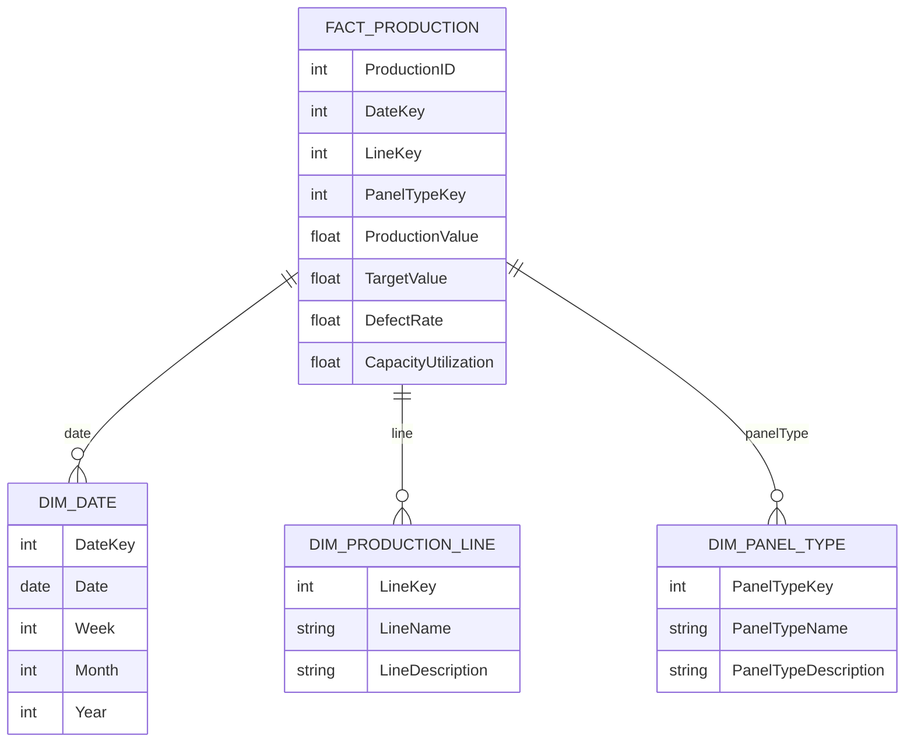

# Solar Panel KPIs BI Report Data Model Documentation

## Standards

IEC 61970 for Energy Management System Integration, Logical Semantic Data Model with fact and dimension tables to be deployed to Azure Synapse Analytics dedicated pool.

## LogicalDataModel

The logical data model is designed to support the BI application for monitoring solar panel production and capacity. It includes fact tables for capturing transactional data and dimension tables for contextual data.

## FactTables

- {'TableName': 'FACT_PRODUCTION', 'Fields': [{'FieldName': 'ProductionID', 'DataType': 'INT', 'IsPrimaryKey': True, 'IsForeignKey': False}, {'FieldName': 'DateKey', 'DataType': 'INT', 'IsPrimaryKey': False, 'IsForeignKey': True}, {'FieldName': 'LineKey', 'DataType': 'INT', 'IsPrimaryKey': False, 'IsForeignKey': True}, {'FieldName': 'PanelTypeKey', 'DataType': 'INT', 'IsPrimaryKey': False, 'IsForeignKey': True}, {'FieldName': 'ProductionValue', 'DataType': 'FLOAT', 'IsPrimaryKey': False, 'IsForeignKey': False}, {'FieldName': 'TargetValue', 'DataType': 'FLOAT', 'IsPrimaryKey': False, 'IsForeignKey': False}, {'FieldName': 'DefectRate', 'DataType': 'FLOAT', 'IsPrimaryKey': False, 'IsForeignKey': False}, {'FieldName': 'CapacityUtilization', 'DataType': 'FLOAT', 'IsPrimaryKey': False, 'IsForeignKey': False}], 'Description': 'This table records the production metrics, including actual values, targets, defect rates, and capacity utilization.'}

## DimensionTables

- {'TableName': 'DIM_DATE', 'Fields': [{'FieldName': 'DateKey', 'DataType': 'INT', 'IsPrimaryKey': True, 'IsForeignKey': False}, {'FieldName': 'Date', 'DataType': 'DATE', 'IsPrimaryKey': False, 'IsForeignKey': False}, {'FieldName': 'Week', 'DataType': 'INT', 'IsPrimaryKey': False, 'IsForeignKey': False}, {'FieldName': 'Month', 'DataType': 'INT', 'IsPrimaryKey': False, 'IsForeignKey': False}, {'FieldName': 'Year', 'DataType': 'INT', 'IsPrimaryKey': False, 'IsForeignKey': False}], 'Description': 'This dimension table holds the date hierarchy for time-based analysis.'}
- {'TableName': 'DIM_PRODUCTION_LINE', 'Fields': [{'FieldName': 'LineKey', 'DataType': 'INT', 'IsPrimaryKey': True, 'IsForeignKey': False}, {'FieldName': 'LineName', 'DataType': 'VARCHAR', 'IsPrimaryKey': False, 'IsForeignKey': False}, {'FieldName': 'LineDescription', 'DataType': 'VARCHAR', 'IsPrimaryKey': False, 'IsForeignKey': False}], 'Description': 'This dimension table contains information about the production lines.'}
- {'TableName': 'DIM_PANEL_TYPE', 'Fields': [{'FieldName': 'PanelTypeKey', 'DataType': 'INT', 'IsPrimaryKey': True, 'IsForeignKey': False}, {'FieldName': 'PanelTypeName', 'DataType': 'VARCHAR', 'IsPrimaryKey': False, 'IsForeignKey': False}, {'FieldName': 'PanelTypeDescription', 'DataType': 'VARCHAR', 'IsPrimaryKey': False, 'IsForeignKey': False}], 'Description': 'This dimension table categorizes the solar panels by type.'}

## ERDiagram

            

## AnythingUnlear

