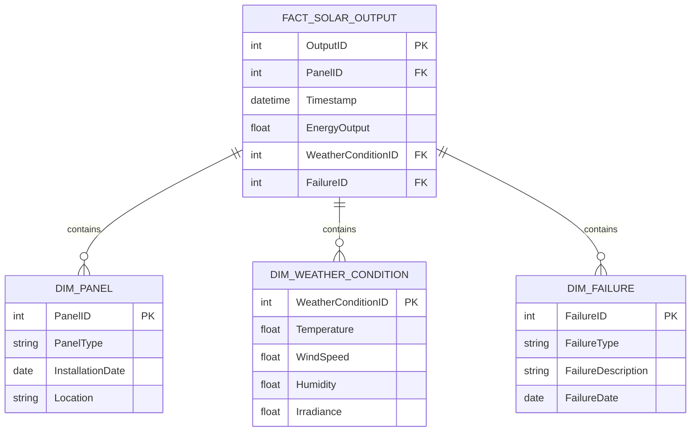

# Data Model Design Document for Solar Panel BI Dashboard

## Standards

Data Modeling adheres to IEC 61970 for Energy Management System Integration. Logical Semantic Data Model with fact and dimension tables designed for deployment to Azure Synapse Analytics dedicated pool.

## LogicalDataModel

The logical data model is structured to support the interactive BI Dashboard, enabling analysis of solar panel performance, identification of underperforming panels, and failure analysis.

## FactTables

- {'TableName': 'FACT_SOLAR_OUTPUT', 'Fields': [{'FieldName': 'OutputID', 'DataType': 'INT', 'IsPrimaryKey': True, 'IsForeignKey': False}, {'FieldName': 'PanelID', 'DataType': 'INT', 'IsPrimaryKey': False, 'IsForeignKey': True}, {'FieldName': 'Timestamp', 'DataType': 'DATETIME', 'IsPrimaryKey': False, 'IsForeignKey': False}, {'FieldName': 'EnergyOutput', 'DataType': 'FLOAT', 'IsPrimaryKey': False, 'IsForeignKey': False}, {'FieldName': 'WeatherConditionID', 'DataType': 'INT', 'IsPrimaryKey': False, 'IsForeignKey': True}, {'FieldName': 'FailureID', 'DataType': 'INT', 'IsPrimaryKey': False, 'IsForeignKey': True}], 'Description': 'Captures the energy output of solar panels over time, including weather conditions and failure events.'}

## DimensionTables

- {'TableName': 'DIM_PANEL', 'Fields': [{'FieldName': 'PanelID', 'DataType': 'INT', 'IsPrimaryKey': True, 'IsForeignKey': False}, {'FieldName': 'PanelType', 'DataType': 'VARCHAR', 'IsPrimaryKey': False, 'IsForeignKey': False}, {'FieldName': 'InstallationDate', 'DataType': 'DATE', 'IsPrimaryKey': False, 'IsForeignKey': False}, {'FieldName': 'Location', 'DataType': 'VARCHAR', 'IsPrimaryKey': False, 'IsForeignKey': False}], 'Description': 'Stores information about each solar panel, including type, installation date, and location.'}
- {'TableName': 'DIM_WEATHER_CONDITION', 'Fields': [{'FieldName': 'WeatherConditionID', 'DataType': 'INT', 'IsPrimaryKey': True, 'IsForeignKey': False}, {'FieldName': 'Temperature', 'DataType': 'FLOAT', 'IsPrimaryKey': False, 'IsForeignKey': False}, {'FieldName': 'WindSpeed', 'DataType': 'FLOAT', 'IsPrimaryKey': False, 'IsForeignKey': False}, {'FieldName': 'Humidity', 'DataType': 'FLOAT', 'IsPrimaryKey': False, 'IsForeignKey': False}, {'FieldName': 'Irradiance', 'DataType': 'FLOAT', 'IsPrimaryKey': False, 'IsForeignKey': False}], 'Description': 'Contains the weather conditions that may affect solar panel performance.'}
- {'TableName': 'DIM_FAILURE', 'Fields': [{'FieldName': 'FailureID', 'DataType': 'INT', 'IsPrimaryKey': True, 'IsForeignKey': False}, {'FieldName': 'FailureType', 'DataType': 'VARCHAR', 'IsPrimaryKey': False, 'IsForeignKey': False}, {'FieldName': 'FailureDescription', 'DataType': 'VARCHAR', 'IsPrimaryKey': False, 'IsForeignKey': False}, {'FieldName': 'FailureDate', 'DataType': 'DATE', 'IsPrimaryKey': False, 'IsForeignKey': False}], 'Description': 'Details the types and occurrences of failures experienced by solar panels.'}

## ERDiagram

            

