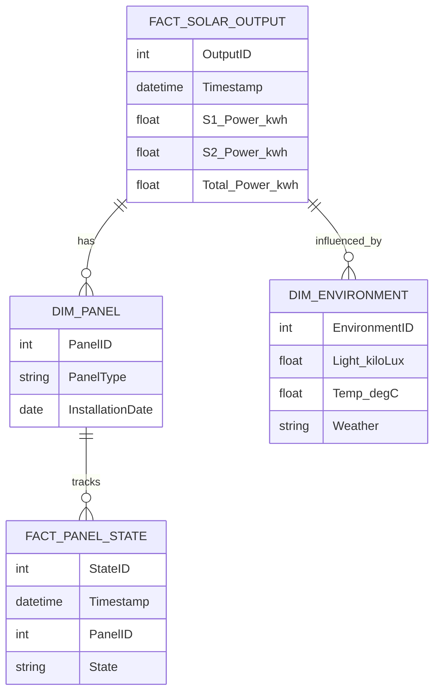

# Solar Panel Performance BI Dashboard Data Model Document

## Standards

IEC 61970 for Energy Management System Integration

## LogicalDataModel

The logical data model is designed to support the BI Dashboard for monitoring and analyzing solar panel performance. It includes entities for solar panel metrics, environmental conditions, and panel states, with relationships that allow for comprehensive analysis and reporting.

## FactTables

- {'TableName': 'FACT_SOLAR_OUTPUT', 'Fields': [{'FieldName': 'OutputID', 'DataType': 'INT', 'IsPrimaryKey': True, 'IsForeignKey': False}, {'FieldName': 'Timestamp', 'DataType': 'DATETIME', 'IsPrimaryKey': False, 'IsForeignKey': False}, {'FieldName': 'S1_Power_kwh', 'DataType': 'FLOAT', 'IsPrimaryKey': False, 'IsForeignKey': False}, {'FieldName': 'S2_Power_kwh', 'DataType': 'FLOAT', 'IsPrimaryKey': False, 'IsForeignKey': False}, {'FieldName': 'Total_Power_kwh', 'DataType': 'FLOAT', 'IsPrimaryKey': False, 'IsForeignKey': False}], 'Description': 'This fact table records the power output of solar panels, including individual and total energy output.'}
- {'TableName': 'FACT_PANEL_STATE', 'Fields': [{'FieldName': 'StateID', 'DataType': 'INT', 'IsPrimaryKey': True, 'IsForeignKey': False}, {'FieldName': 'Timestamp', 'DataType': 'DATETIME', 'IsPrimaryKey': False, 'IsForeignKey': False}, {'FieldName': 'PanelID', 'DataType': 'INT', 'IsPrimaryKey': False, 'IsForeignKey': True}, {'FieldName': 'State', 'DataType': 'VARCHAR', 'IsPrimaryKey': False, 'IsForeignKey': False}], 'Description': 'This fact table captures the operational state of each solar panel over time to track performance and failures.'}

## DimensionTables

- {'TableName': 'DIM_PANEL', 'Fields': [{'FieldName': 'PanelID', 'DataType': 'INT', 'IsPrimaryKey': True, 'IsForeignKey': False}, {'FieldName': 'PanelType', 'DataType': 'VARCHAR', 'IsPrimaryKey': False, 'IsForeignKey': False}, {'FieldName': 'InstallationDate', 'DataType': 'DATE', 'IsPrimaryKey': False, 'IsForeignKey': False}], 'Description': 'Dimension table for solar panels with details about each panel.'}
- {'TableName': 'DIM_ENVIRONMENT', 'Fields': [{'FieldName': 'EnvironmentID', 'DataType': 'INT', 'IsPrimaryKey': True, 'IsForeignKey': False}, {'FieldName': 'Light_kiloLux', 'DataType': 'FLOAT', 'IsPrimaryKey': False, 'IsForeignKey': False}, {'FieldName': 'Temp_degC', 'DataType': 'FLOAT', 'IsPrimaryKey': False, 'IsForeignKey': False}, {'FieldName': 'Weather', 'DataType': 'VARCHAR', 'IsPrimaryKey': False, 'IsForeignKey': False}], 'Description': 'Dimension table for environmental conditions affecting solar panel performance.'}

## ERDiagram

            

