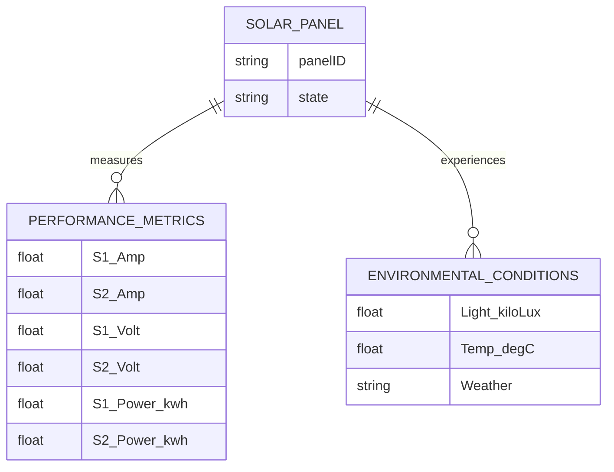

# Solar Panel Performance BI Dashboard Data Model Documentation

## Standards

IEC 61970 for Energy Management System Integration

## LogicalDataModel

The logical data model is designed to support the BI Dashboard requirements for monitoring and analyzing solar panel performance. It includes entities for Solar Panels, Performance Metrics, and Environmental Conditions, with relationships that allow for the analysis of energy output, underperformance, and failure rates.

## ERDiagram

