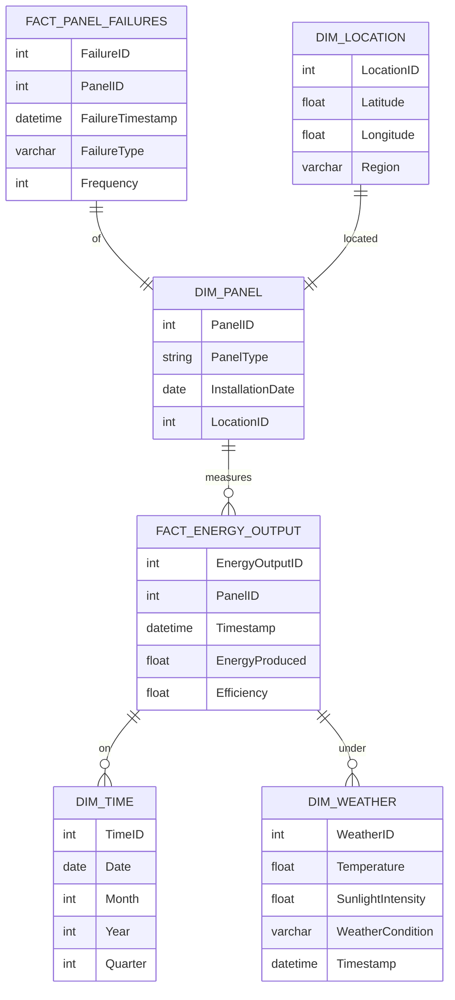

# Data Model Design Document for Solar Panel Performance Monitoring BI Dashboard

## Standards

Data Modeling: IEC 61970 for Energy Management System Integration, Data Models: Logical Semantic Data Model with fact and dimension tables to be deployed to Azure Synapse Analytics dedicated pool.

## LogicalDataModel

The logical data model is designed to support the interactive BI Dashboard for monitoring and analyzing the performance of solar panels. It includes fact and dimension tables that capture data about energy output, panel performance, maintenance activities, and environmental factors.

## FactTables

- {'TableName': 'FACT_ENERGY_OUTPUT', 'Fields': [{'FieldName': 'EnergyOutputID', 'DataType': 'INT', 'IsPrimaryKey': True, 'IsForeignKey': False}, {'FieldName': 'PanelID', 'DataType': 'INT', 'IsPrimaryKey': False, 'IsForeignKey': True}, {'FieldName': 'Timestamp', 'DataType': 'DATETIME', 'IsPrimaryKey': False, 'IsForeignKey': False}, {'FieldName': 'EnergyProduced', 'DataType': 'FLOAT', 'IsPrimaryKey': False, 'IsForeignKey': False}, {'FieldName': 'Efficiency', 'DataType': 'FLOAT', 'IsPrimaryKey': False, 'IsForeignKey': False}], 'Description': 'This table records the energy output of each solar panel, including the time of recording and the efficiency of energy production.'}
- {'TableName': 'FACT_PANEL_FAILURES', 'Fields': [{'FieldName': 'FailureID', 'DataType': 'INT', 'IsPrimaryKey': True, 'IsForeignKey': False}, {'FieldName': 'PanelID', 'DataType': 'INT', 'IsPrimaryKey': False, 'IsForeignKey': True}, {'FieldName': 'FailureTimestamp', 'DataType': 'DATETIME', 'IsPrimaryKey': False, 'IsForeignKey': False}, {'FieldName': 'FailureType', 'DataType': 'VARCHAR', 'IsPrimaryKey': False, 'IsForeignKey': False}, {'FieldName': 'Frequency', 'DataType': 'INT', 'IsPrimaryKey': False, 'IsForeignKey': False}], 'Description': 'This table logs instances of solar panel failures, categorizing the type of failure and its frequency.'}

## DimensionTables

- {'TableName': 'DIM_PANEL', 'Fields': [{'FieldName': 'PanelID', 'DataType': 'INT', 'IsPrimaryKey': True, 'IsForeignKey': False}, {'FieldName': 'PanelType', 'DataType': 'VARCHAR', 'IsPrimaryKey': False, 'IsForeignKey': False}, {'FieldName': 'InstallationDate', 'DataType': 'DATE', 'IsPrimaryKey': False, 'IsForeignKey': False}, {'FieldName': 'LocationID', 'DataType': 'INT', 'IsPrimaryKey': False, 'IsForeignKey': True}], 'Description': 'This dimension table contains information about each solar panel, including type and installation details.'}
- {'TableName': 'DIM_LOCATION', 'Fields': [{'FieldName': 'LocationID', 'DataType': 'INT', 'IsPrimaryKey': True, 'IsForeignKey': False}, {'FieldName': 'Latitude', 'DataType': 'FLOAT', 'IsPrimaryKey': False, 'IsForeignKey': False}, {'FieldName': 'Longitude', 'DataType': 'FLOAT', 'IsPrimaryKey': False, 'IsForeignKey': False}, {'FieldName': 'Region', 'DataType': 'VARCHAR', 'IsPrimaryKey': False, 'IsForeignKey': False}], 'Description': 'This dimension table stores location data for where solar panels are installed, which can be used for regional analysis and performance comparison.'}
- {'TableName': 'DIM_TIME', 'Fields': [{'FieldName': 'TimeID', 'DataType': 'INT', 'IsPrimaryKey': True, 'IsForeignKey': False}, {'FieldName': 'Date', 'DataType': 'DATE', 'IsPrimaryKey': False, 'IsForeignKey': False}, {'FieldName': 'Month', 'DataType': 'INT', 'IsPrimaryKey': False, 'IsForeignKey': False}, {'FieldName': 'Year', 'DataType': 'INT', 'IsPrimaryKey': False, 'IsForeignKey': False}, {'FieldName': 'Quarter', 'DataType': 'INT', 'IsPrimaryKey': False, 'IsForeignKey': False}], 'Description': 'This dimension table provides a time reference for all facts recorded in the system, enabling time-based analysis and reporting.'}
- {'TableName': 'DIM_WEATHER', 'Fields': [{'FieldName': 'WeatherID', 'DataType': 'INT', 'IsPrimaryKey': True, 'IsForeignKey': False}, {'FieldName': 'Temperature', 'DataType': 'FLOAT', 'IsPrimaryKey': False, 'IsForeignKey': False}, {'FieldName': 'SunlightIntensity', 'DataType': 'FLOAT', 'IsPrimaryKey': False, 'IsForeignKey': False}, {'FieldName': 'WeatherCondition', 'DataType': 'VARCHAR', 'IsPrimaryKey': False, 'IsForeignKey': False}, {'FieldName': 'Timestamp', 'DataType': 'DATETIME', 'IsPrimaryKey': False, 'IsForeignKey': True}], 'Description': 'This dimension table captures environmental conditions that may affect solar panel performance, such as temperature and sunlight intensity.'}

## ERDiagram

            

