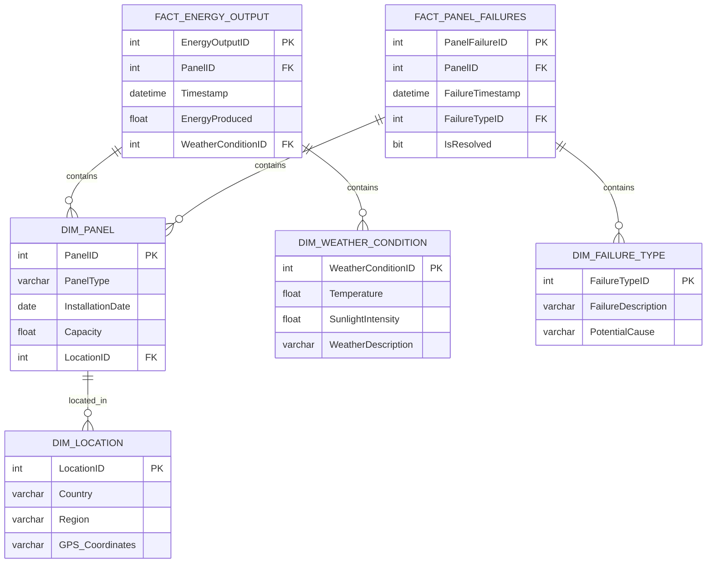

# Data Model Design Document for Solar Panel Performance Monitoring BI Dashboard

## Standards

Data Modeling: IEC 61970 for Energy Management System Integration, Data Models: Logical Semantic Data Model with fact and dimension tables to be deployed to Azure Synapse Analytics dedicated pool.

## LogicalDataModel

The logical data model is designed to support the interactive BI Dashboard for monitoring and analyzing solar panel performance. It includes fact tables for capturing transactional data and dimension tables for contextual data.

## FactTables

- {'TableName': 'FACT_ENERGY_OUTPUT', 'Fields': [{'FieldName': 'EnergyOutputID', 'DataType': 'INT', 'IsPrimaryKey': True, 'IsForeignKey': False}, {'FieldName': 'PanelID', 'DataType': 'INT', 'IsPrimaryKey': False, 'IsForeignKey': True}, {'FieldName': 'Timestamp', 'DataType': 'DATETIME', 'IsPrimaryKey': False, 'IsForeignKey': False}, {'FieldName': 'EnergyProduced', 'DataType': 'FLOAT', 'IsPrimaryKey': False, 'IsForeignKey': False}, {'FieldName': 'WeatherConditionID', 'DataType': 'INT', 'IsPrimaryKey': False, 'IsForeignKey': True}], 'Description': 'Records the energy output of each solar panel with a timestamp and weather conditions.'}
- {'TableName': 'FACT_PANEL_FAILURES', 'Fields': [{'FieldName': 'PanelFailureID', 'DataType': 'INT', 'IsPrimaryKey': True, 'IsForeignKey': False}, {'FieldName': 'PanelID', 'DataType': 'INT', 'IsPrimaryKey': False, 'IsForeignKey': True}, {'FieldName': 'FailureTimestamp', 'DataType': 'DATETIME', 'IsPrimaryKey': False, 'IsForeignKey': False}, {'FieldName': 'FailureTypeID', 'DataType': 'INT', 'IsPrimaryKey': False, 'IsForeignKey': True}, {'FieldName': 'IsResolved', 'DataType': 'BIT', 'IsPrimaryKey': False, 'IsForeignKey': False}], 'Description': 'Tracks incidents of solar panel failures, their types, and resolution status.'}

## DimensionTables

- {'TableName': 'DIM_PANEL', 'Fields': [{'FieldName': 'PanelID', 'DataType': 'INT', 'IsPrimaryKey': True, 'IsForeignKey': False}, {'FieldName': 'PanelType', 'DataType': 'VARCHAR', 'IsPrimaryKey': False, 'IsForeignKey': False}, {'FieldName': 'InstallationDate', 'DataType': 'DATE', 'IsPrimaryKey': False, 'IsForeignKey': False}, {'FieldName': 'Capacity', 'DataType': 'FLOAT', 'IsPrimaryKey': False, 'IsForeignKey': False}, {'FieldName': 'LocationID', 'DataType': 'INT', 'IsPrimaryKey': False, 'IsForeignKey': True}], 'Description': 'Contains information about each solar panel, including type, installation date, and capacity.'}
- {'TableName': 'DIM_WEATHER_CONDITION', 'Fields': [{'FieldName': 'WeatherConditionID', 'DataType': 'INT', 'IsPrimaryKey': True, 'IsForeignKey': False}, {'FieldName': 'Temperature', 'DataType': 'FLOAT', 'IsPrimaryKey': False, 'IsForeignKey': False}, {'FieldName': 'SunlightIntensity', 'DataType': 'FLOAT', 'IsPrimaryKey': False, 'IsForeignKey': False}, {'FieldName': 'WeatherDescription', 'DataType': 'VARCHAR', 'IsPrimaryKey': False, 'IsForeignKey': False}], 'Description': 'Describes the weather conditions, including temperature and sunlight intensity.'}
- {'TableName': 'DIM_FAILURE_TYPE', 'Fields': [{'FieldName': 'FailureTypeID', 'DataType': 'INT', 'IsPrimaryKey': True, 'IsForeignKey': False}, {'FieldName': 'FailureDescription', 'DataType': 'VARCHAR', 'IsPrimaryKey': False, 'IsForeignKey': False}, {'FieldName': 'PotentialCause', 'DataType': 'VARCHAR', 'IsPrimaryKey': False, 'IsForeignKey': False}], 'Description': 'Classifies types of solar panel failures and their potential causes.'}
- {'TableName': 'DIM_LOCATION', 'Fields': [{'FieldName': 'LocationID', 'DataType': 'INT', 'IsPrimaryKey': True, 'IsForeignKey': False}, {'FieldName': 'Country', 'DataType': 'VARCHAR', 'IsPrimaryKey': False, 'IsForeignKey': False}, {'FieldName': 'Region', 'DataType': 'VARCHAR', 'IsPrimaryKey': False, 'IsForeignKey': False}, {'FieldName': 'GPS_Coordinates', 'DataType': 'VARCHAR', 'IsPrimaryKey': False, 'IsForeignKey': False}], 'Description': 'Provides geographical information of solar panel installations.'}

## ERDiagram

            

