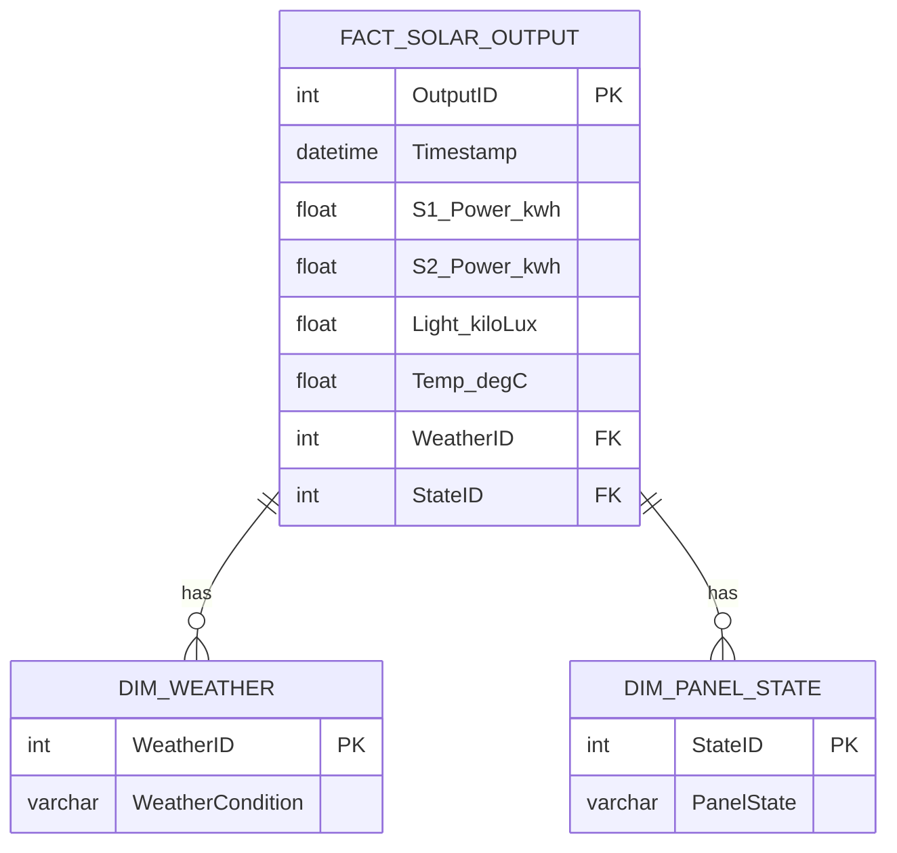

# Solar Panel Sensor Data BI Dashboard Data Model Document

## Standards

Data Modeling: IEC 61970 for Energy Management System Integration, Data Models: Logical Semantic Data Model with fact and dimension tables.

## LogicalDataModel

The logical data model is designed to support the KPIs and insights required for the BI Dashboard, focusing on current energy output, underperforming solar panels, panel failure rates, and predictive failure analysis.

## FactTables

- {'TableName': 'FACT_SOLAR_OUTPUT', 'Fields': [{'FieldName': 'OutputID', 'DataType': 'INT', 'IsPrimaryKey': True, 'IsForeignKey': False}, {'FieldName': 'Timestamp', 'DataType': 'DATETIME', 'IsPrimaryKey': False, 'IsForeignKey': False}, {'FieldName': 'S1_Power_kwh', 'DataType': 'FLOAT', 'IsPrimaryKey': False, 'IsForeignKey': False}, {'FieldName': 'S2_Power_kwh', 'DataType': 'FLOAT', 'IsPrimaryKey': False, 'IsForeignKey': False}, {'FieldName': 'Light_kiloLux', 'DataType': 'FLOAT', 'IsPrimaryKey': False, 'IsForeignKey': False}, {'FieldName': 'Temp_degC', 'DataType': 'FLOAT', 'IsPrimaryKey': False, 'IsForeignKey': False}, {'FieldName': 'WeatherID', 'DataType': 'INT', 'IsPrimaryKey': False, 'IsForeignKey': True}, {'FieldName': 'StateID', 'DataType': 'INT', 'IsPrimaryKey': False, 'IsForeignKey': True}], 'Description': 'This fact table captures the power output and environmental conditions for each solar panel at various timestamps.'}

## DimensionTables

- {'TableName': 'DIM_WEATHER', 'Fields': [{'FieldName': 'WeatherID', 'DataType': 'INT', 'IsPrimaryKey': True, 'IsForeignKey': False}, {'FieldName': 'WeatherCondition', 'DataType': 'VARCHAR', 'IsPrimaryKey': False, 'IsForeignKey': False}], 'Description': 'Dimension table for weather conditions, referenced by the FACT_SOLAR_OUTPUT table.'}
- {'TableName': 'DIM_PANEL_STATE', 'Fields': [{'FieldName': 'StateID', 'DataType': 'INT', 'IsPrimaryKey': True, 'IsForeignKey': False}, {'FieldName': 'PanelState', 'DataType': 'VARCHAR', 'IsPrimaryKey': False, 'IsForeignKey': False}], 'Description': 'Dimension table for the state of the solar panels, indicating normal operation or various types of faults.'}

## ERDiagram

            

