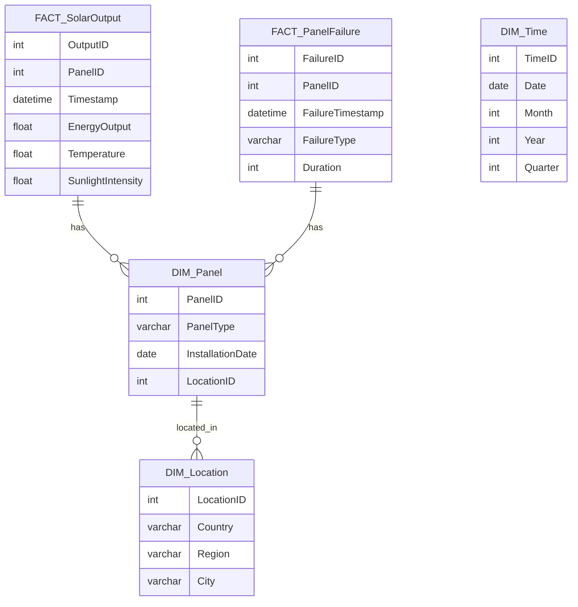

# Data Model Design Document for Solar Panel Performance BI Dashboard

## Standards

Data Modeling: IEC 61970 for Energy Management System Integration, Data Models: Logical Semantic Data Model with fact and dimension tables to be deployed to Azure Synapse Analytics dedicated pool.

## LogicalDataModel

The logical data model is designed to support the interactive BI Dashboard for monitoring, analyzing, and predicting solar panel performance. It includes fact tables for capturing transactional data and dimension tables for descriptive attributes.

## FactTables

- {'TableName': 'FACT_SolarOutput', 'Fields': [{'FieldName': 'OutputID', 'DataType': 'INT', 'IsPrimaryKey': True, 'IsForeignKey': False}, {'FieldName': 'PanelID', 'DataType': 'INT', 'IsPrimaryKey': False, 'IsForeignKey': True}, {'FieldName': 'Timestamp', 'DataType': 'DATETIME', 'IsPrimaryKey': False, 'IsForeignKey': False}, {'FieldName': 'EnergyOutput', 'DataType': 'FLOAT', 'IsPrimaryKey': False, 'IsForeignKey': False}, {'FieldName': 'Temperature', 'DataType': 'FLOAT', 'IsPrimaryKey': False, 'IsForeignKey': False}, {'FieldName': 'SunlightIntensity', 'DataType': 'FLOAT', 'IsPrimaryKey': False, 'IsForeignKey': False}], 'Description': 'Captures the real-time energy output of solar panels, including environmental factors.'}
- {'TableName': 'FACT_PanelFailure', 'Fields': [{'FieldName': 'FailureID', 'DataType': 'INT', 'IsPrimaryKey': True, 'IsForeignKey': False}, {'FieldName': 'PanelID', 'DataType': 'INT', 'IsPrimaryKey': False, 'IsForeignKey': True}, {'FieldName': 'FailureTimestamp', 'DataType': 'DATETIME', 'IsPrimaryKey': False, 'IsForeignKey': False}, {'FieldName': 'FailureType', 'DataType': 'VARCHAR', 'IsPrimaryKey': False, 'IsForeignKey': False}, {'FieldName': 'Duration', 'DataType': 'INT', 'IsPrimaryKey': False, 'IsForeignKey': False}], 'Description': 'Records instances of solar panel failures, their types, and durations.'}

## DimensionTables

- {'TableName': 'DIM_Panel', 'Fields': [{'FieldName': 'PanelID', 'DataType': 'INT', 'IsPrimaryKey': True, 'IsForeignKey': False}, {'FieldName': 'PanelType', 'DataType': 'VARCHAR', 'IsPrimaryKey': False, 'IsForeignKey': False}, {'FieldName': 'InstallationDate', 'DataType': 'DATE', 'IsPrimaryKey': False, 'IsForeignKey': False}, {'FieldName': 'LocationID', 'DataType': 'INT', 'IsPrimaryKey': False, 'IsForeignKey': True}], 'Description': 'Descriptive details of each solar panel, including type and installation information.'}
- {'TableName': 'DIM_Location', 'Fields': [{'FieldName': 'LocationID', 'DataType': 'INT', 'IsPrimaryKey': True, 'IsForeignKey': False}, {'FieldName': 'Country', 'DataType': 'VARCHAR', 'IsPrimaryKey': False, 'IsForeignKey': False}, {'FieldName': 'Region', 'DataType': 'VARCHAR', 'IsPrimaryKey': False, 'IsForeignKey': False}, {'FieldName': 'City', 'DataType': 'VARCHAR', 'IsPrimaryKey': False, 'IsForeignKey': False}], 'Description': 'Geographic information of where solar panels are installed.'}
- {'TableName': 'DIM_Time', 'Fields': [{'FieldName': 'TimeID', 'DataType': 'INT', 'IsPrimaryKey': True, 'IsForeignKey': False}, {'FieldName': 'Date', 'DataType': 'DATE', 'IsPrimaryKey': False, 'IsForeignKey': False}, {'FieldName': 'Month', 'DataType': 'INT', 'IsPrimaryKey': False, 'IsForeignKey': False}, {'FieldName': 'Year', 'DataType': 'INT', 'IsPrimaryKey': False, 'IsForeignKey': False}, {'FieldName': 'Quarter', 'DataType': 'INT', 'IsPrimaryKey': False, 'IsForeignKey': False}], 'Description': 'Time dimension to enable analysis over different periods.'}

## ERDiagram

            

## AnythingUnlear

