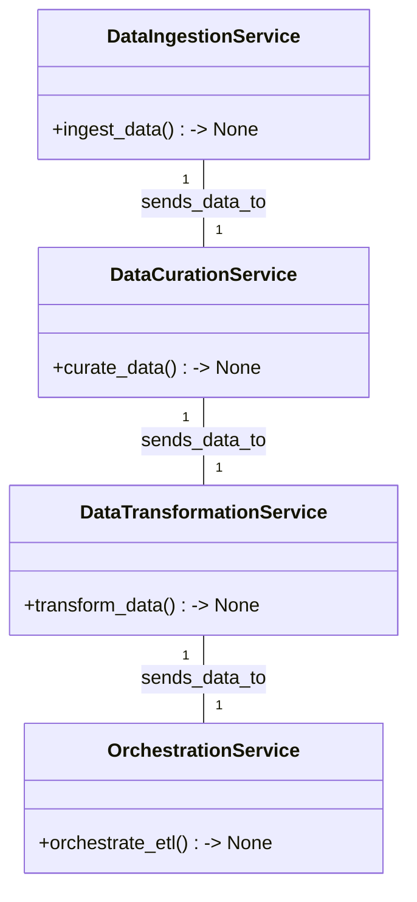
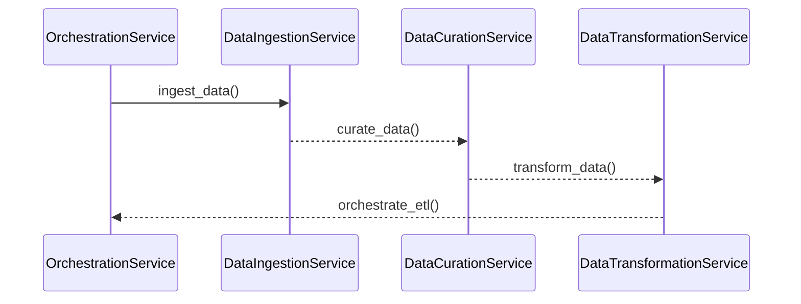

# Technical Design Document for Solar Panel Performance BI Dashboard

## HighLevelSystemDesign

The solution architecture is based on a microservices architecture pattern, which aligns with the organization's standards of using Python for ETL processes. The architecture will consist of several loosely coupled microservices, each responsible for a specific part of the ETL pipeline. These microservices will be orchestrated to work together to ingest, curate, transform, and load the data into the BI tool for real-time analytics.

## DataIngestion

The data_ingestion microservice will be responsible for ingesting data from the provided solar_sensors.csv file. It will monitor the source directory for new or updated files and ingest them into the system. The ingestion process will be configurable to handle different data sources in the future if required.

## DataCuration

The data_curation microservice will perform initial quality checks on the ingested data. It will ensure there are no duplicates and that the data conforms to the expected schema. Given that the dataset has no missing values, the focus will be on validating the data types and ranges of the numerical values to ensure they are within expected limits.

## DataTransformation

The data_transformation microservice will apply business logic to calculate KPIs such as 'Total Energy Output', 'Panel Efficiency', and 'Failure Rate'. It will transform the data according to the logical data model provided, ensuring that the data is in the correct format for analysis and reporting within the BI dashboard.

## DataVisualization

The data_visualization microservice will not be implemented directly, as the design of visualizations will be handled by the BI tool. However, this microservice will ensure that the data is prepared and available in a format that can be easily used by the BI tool to create interactive visualizations such as time-series graphs, heat maps, and bar charts.

## Orchestration

The orchestration layer will coordinate the execution of the microservices, ensuring that data flows smoothly from ingestion to visualization. It will handle scheduling, error handling, and recovery, as well as logging to monitor the health and performance of the ETL pipeline.

## ClassDiagrams

## ProgramFlow

