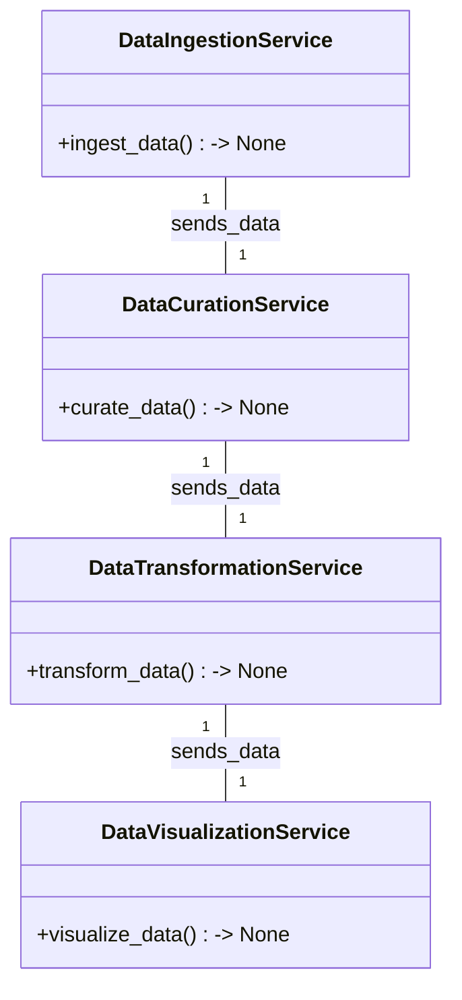
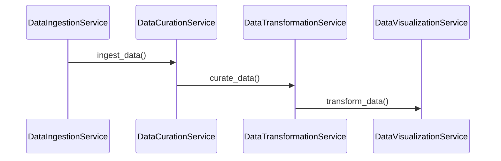

# Technical Design Document for Solar Panel Performance BI Dashboard

## HighLevelSystemDesign

The solution architecture is based on a microservices architecture pattern, which aligns with the organization's standards of using Python for implementation. The architecture will consist of several independent microservices, each responsible for a specific aspect of the ETL data pipeline. These microservices will be orchestrated to work together to ingest, curate, transform, and visualize the data from the solar_sensors.csv file, ensuring real-time updates and interactive capabilities for the BI Dashboard.

## DataIngestion

The data_ingestion microservice will be responsible for ingesting data from the provided CSV file. It will monitor the file location for any updates and ingest new data accordingly. The service will be configurable to handle different data sources in the future if required.

## DataCuration

The data_curation microservice will ensure the quality of the ingested data. It will check for duplicates and perform any necessary data cleaning steps. This service will also handle the mapping of source data to the target schema as defined in the logical data model.

## DataTransformation

The data_transformation microservice will apply business logic to the curated data to calculate the KPIs such as 'Total Energy Output', 'Panel Efficiency', and 'Failure Rate'. It will transform the data according to the requirements for visualization and analysis, ensuring that the data model supports efficient data retrieval.

## DataVisualization

The data_visualization microservice will generate the required visualizations for the BI Dashboard. It will use the transformed data to create interactive charts and graphs that allow users to understand the performance of the solar panels. This service will ensure that visualizations are responsive and accessible on both desktop and mobile devices.

## Orchestration

The orchestration layer will coordinate the execution of the microservices, ensuring that data flows smoothly from ingestion to visualization. It will automate the data update process to minimize manual intervention and ensure that the dashboard reflects the most current information.

## ClassDiagrams

## ProgramFlow

