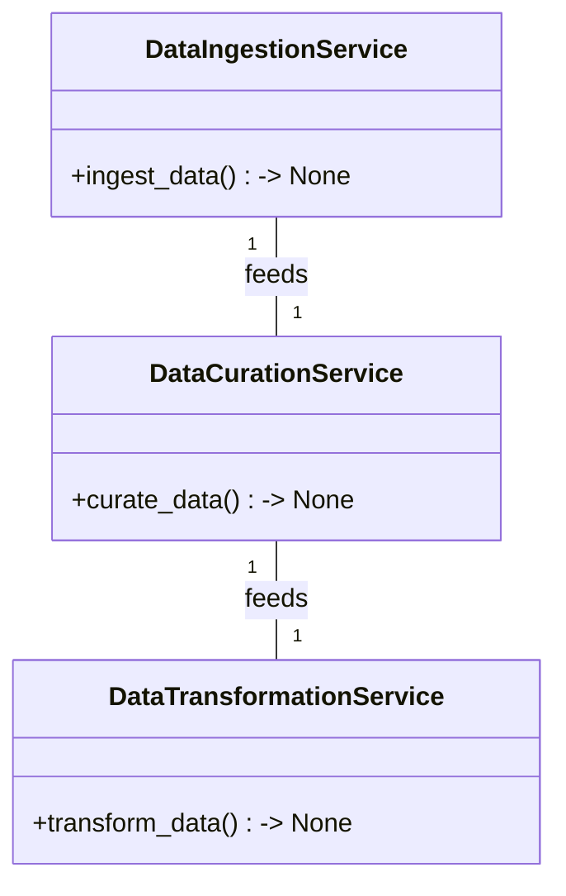
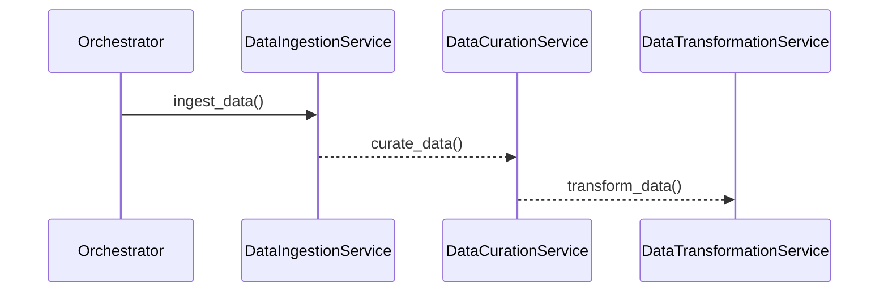

# Technical Design Document for Solar Panel BI Dashboard ETL Pipeline

## HighLevelSystemDesign

The ETL data pipeline for the Solar Panel BI Dashboard will be designed using a microservices architecture, where each microservice is implemented using Python. The microservices will be orchestrated to deliver a robust and scalable ETL pipeline that supports real-time data processing and visualization. The architecture will be simple, extendable, and capable of running locally as per the organization's standards.

## DataIngestion

The data_ingestion microservice will be responsible for extracting data from the solar_sensors.csv file located at the client's specified path. The service will parse the CSV file and load the data into an intermediate storage solution, ensuring that the raw data is available for the subsequent stages of the ETL process.

## DataCuration

The data_curation microservice will handle data quality and preparation tasks. It will remove duplicates, handle missing values through imputation or exclusion, and map source data to the target schema as defined in the logical data model. The curated data will be stored in a format that is optimized for the transformation process.

## DataTransformation

The data_transformation microservice will apply business logic to calculate KPIs such as total energy output, performance metrics, and failure rates. It will transform the curated data according to the logical data model, ensuring that the data is in the correct format for visualization and analysis within the BI tool.

## DataVisualization

The data_visualization microservice will not be implemented directly by the Data Architect but will be considered in the design to ensure that the transformed data is compatible with BI tools such as Tableau or Power BI. The microservice will facilitate the loading of transformed data into the BI tool, where visualizations such as time series graphs, heat maps, and bar charts will be created.

## Orchestration

The orchestration component will manage the workflow of the ETL pipeline, ensuring that data is ingested, curated, and transformed in a timely manner. It will support real-time updates or, at a minimum, daily updates to the dashboard. The orchestrator will also handle error logging and retry mechanisms to ensure data integrity and availability.

## ClassDiagrams

## ProgramFlow

