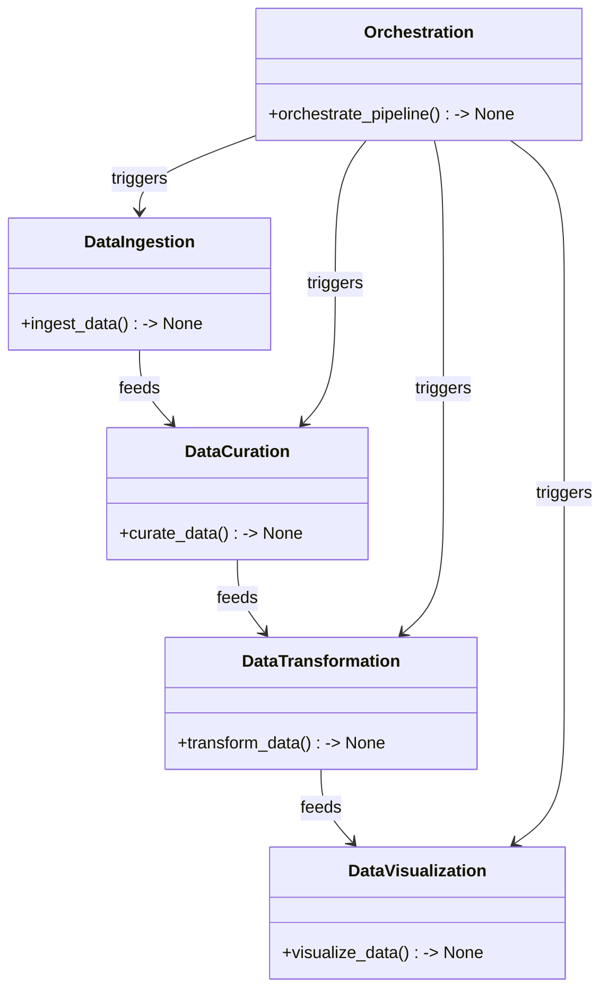
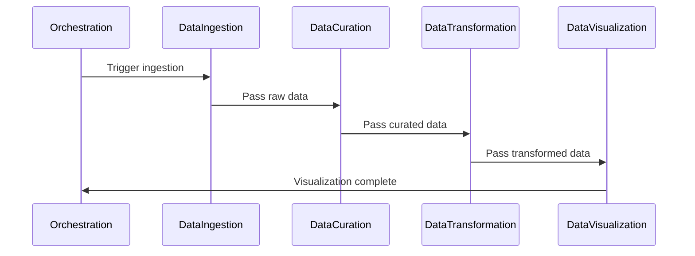

# Technical Design Document for Solar Panel Performance Monitoring BI Dashboard

## HighLevelSystemDesign

The solution architecture is based on a microservices architecture pattern, leveraging Python for the development of individual services. These services will be orchestrated using Azure Data Factory or a similar tool to deliver an ETL Data Pipeline that supports the interactive BI Dashboard. The architecture will enable scalability, fault tolerance, and efficient data processing, aligning with the organization's standards for deployment on Azure Synapse Analytics spark pool or Azure Kubernetes, with the option for local deployment.

## DataIngestion

The data_ingestion microservice is responsible for ingesting solar sensor data from the provided CSV file. It will include a Data Adapter sub-component that can handle various data sources, though initially configured for local CSV files. The service will validate and ingest data into a 'raw' data store in Azure Data Lake, ensuring data is available for subsequent processing stages.

## DataCuration

The data_curation microservice will load raw data from the 'raw' data store and perform necessary data cleaning operations such as deduplication and null value imputation. It will also ensure data normalization and mapping to the target schema, storing the curated data in a 'curated' folder within Azure Data Lake as a parquet table for optimized access and query performance.

## DataTransformation

The data_transformation microservice will transform curated data into a format suitable for analysis, based on the logical semantic data model. It will calculate KPIs and metrics as defined in the requirements, storing the results in a 'conformed' data store. This service will handle the complex transformations required to turn raw data into actionable insights for the BI dashboard.

## DataVisualization

The data_visualization microservice will utilize the conformed data to generate visualizations required for the BI Dashboard. It will leverage libraries such as Plotly or Power BI Embedded to create interactive charts and graphs that provide real-time and historical insights into solar panel performance.

## Orchestration

Orchestration will be managed by Azure Data Factory, which will coordinate the execution of the microservices in the correct sequence and schedule. It will handle error logging and provide mechanisms for alerting and retrying failed processes. The orchestration will ensure that data flows smoothly from ingestion to visualization, with checkpoints and validations at each stage.

## ClassDiagrams

## ProgramFlow

