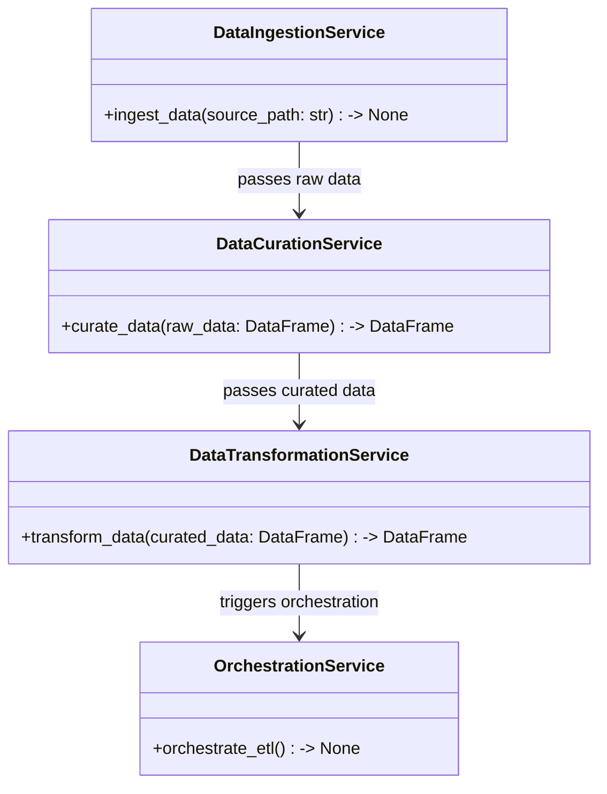
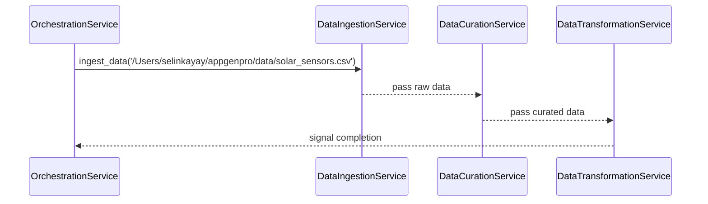

# Technical Design Document for Solar Panel BI Dashboard ETL Pipeline

## HighLevelSystemDesign

The ETL pipeline is designed to support the interactive BI Dashboard for solar panel data analysis. The architecture leverages a microservices approach, with each service responsible for a segment of the ETL process. These services will be implemented using Python and exposed as RESTful APIs, orchestrated using Azure Kubernetes Service (AKS) or Azure Synapse Analytics spark pool, depending on deployment preferences.

## DataIngestion

The data_ingestion microservice is responsible for extracting solar panel sensor data from the provided CSV file. It will validate the file format and ensure data integrity during ingestion. The service will be capable of handling incremental data loads to process new data as it becomes available.

## DataCuration

The data_curation microservice will clean and prepare the ingested data for analysis. This includes handling missing values, deduplication, and validation against predefined schemas. The curated data will be stored in a structured format suitable for transformation and analysis.

## DataTransformation

The data_transformation microservice will apply business logic to the curated data to calculate KPIs such as average energy output, performance comparison, and failure rates. The transformed data will be structured according to the logical data model and stored in Azure Synapse Analytics dedicated pool for efficient querying.

## DataVisualization

While not directly responsible for data visualization, the ETL pipeline will ensure that the data is readily available and optimized for the BI dashboard. The dashboard will utilize the processed data to provide real-time and historical visualizations of energy output, panel performance, and failure analysis.

## Orchestration

The orchestration layer will manage the ETL pipeline's workflow, scheduling tasks, and ensuring data is processed in a timely manner. It will handle dependencies between microservices and provide monitoring and logging capabilities to track the pipeline's performance and health.

## ClassDiagrams

## ProgramFlow

