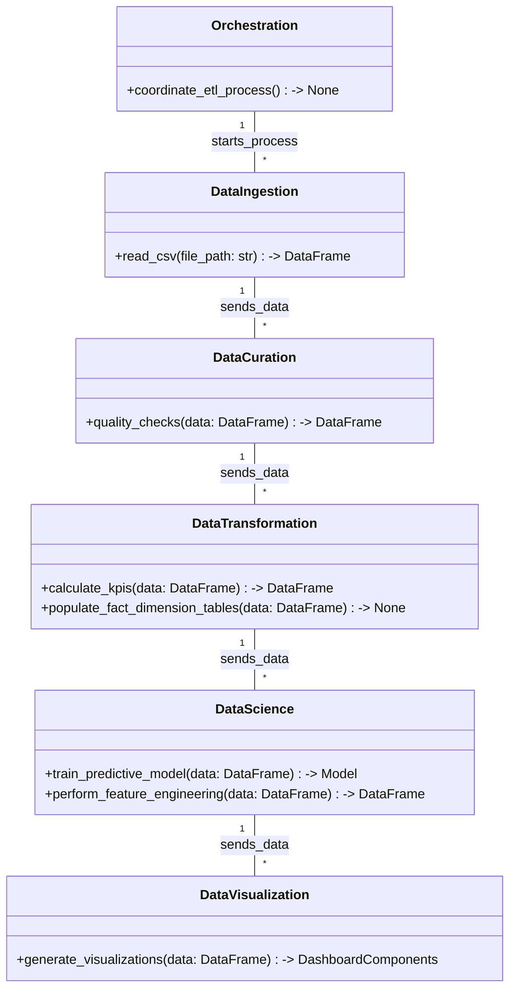
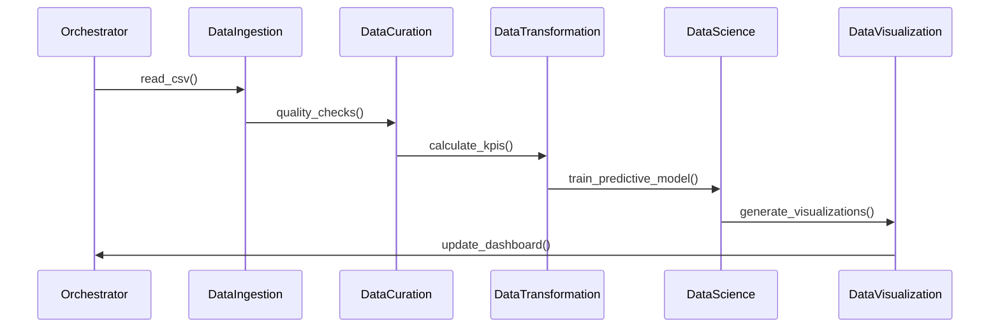

# Technical Design Document for Solar Panel Sensor Data BI Dashboard

## HighLevelSystemDesign

The ETL data pipeline for the Solar Panel Sensor Data BI Dashboard will be constructed using a microservices architecture pattern. Each microservice will be implemented using Python and will be responsible for a specific part of the ETL process: data ingestion, curation, transformation, predictive modeling, and visualization. These microservices will be orchestrated by a central orchestrator, ensuring a seamless flow of data from extraction to visualization.

## DataIngestion

The data_ingestion microservice will be responsible for extracting data from the CSV file located at ~/Desktop/solar_sensors.csv. It will utilize a Python script to read the data and load it into a pandas DataFrame. The ingestion service will be designed to handle updates to the dataset, ensuring new data is ingested as it becomes available.

## DataCuration

The data_curation microservice will perform initial data quality checks, such as verifying the absence of duplicate records and ensuring data types are consistent with the data model. Given the dataset has no missing values, no imputation will be required. The curated data will be stored in a 'curated' directory, ready for transformation.

## DataTransformation

The data_transformation microservice will apply business logic to calculate KPIs such as current energy output, underperformance metrics, and failure rates. It will transform the data according to the logical data model, populating the FACT_SOLAR_OUTPUT, DIM_WEATHER, and DIM_PANEL_STATE tables. The transformed data will be stored in a 'conformed' directory.

## DataScience

The predictive-model microservice will develop a machine learning model to forecast potential solar panel failures. It will use historical data to train the model, perform feature engineering to enhance model accuracy, and select an appropriate machine learning algorithm from scikit-learn or AutoML, as per the project's requirements.

## DataVisualization

The data_visualization microservice will create interactive visualizations using plotly and dash. It will generate time series graphs, performance heatmaps, bar charts, and predictive model outputs. These visualizations will be integrated into the BI Dashboard, providing real-time and historical insights into solar panel performance.

## Orchestration

The orchestration layer will coordinate the execution of the microservices. It will be implemented as a Python script that calls the APIs of each microservice in the correct sequence, handling any dependencies and ensuring data integrity throughout the pipeline.

## ClassDiagrams

## ProgramFlow

