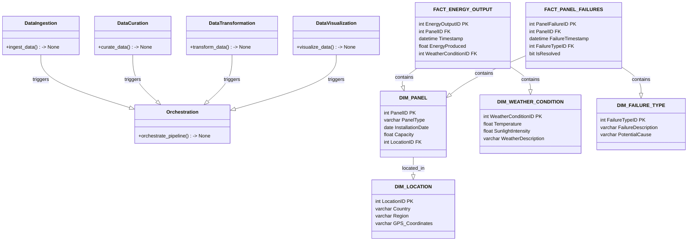
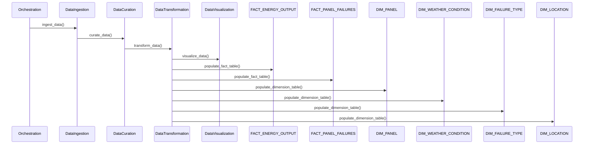

# Technical Design Document for Solar Panel Performance Monitoring BI Dashboard

## HighLevelSystemDesign

The solution architecture is based on a microservices architecture pattern, leveraging Azure Synapse Analytics and Azure Kubernetes Service (AKS) for deployment. The architecture will consist of a series of independent microservices, each responsible for a specific aspect of the ETL process, including data ingestion, curation, transformation, and visualization. These microservices will be implemented using Python and will interact with each other via RESTful APIs.

## DataIngestion

The data_ingestion microservice is responsible for ingesting solar sensor data from the CSV file located at /project_name/data/solar_sensors.csv. It will validate the CSV format and ensure that the data adheres to the expected schema before loading it into the Azure Synapse Analytics dedicated pool for raw data storage.

## DataCuration

The data_curation microservice will handle data quality issues such as missing values and inconsistencies. It will apply imputation methods to fill in missing data and perform data normalization to ensure consistency across different data sources. The curated data will then be stored in a 'curated' data store within Azure Synapse Analytics.

## DataTransformation

The data_transformation microservice will apply business logic to the curated data to calculate KPIs and performance metrics as defined by the client. It will transform the data according to the logical semantic data model, populating the fact and dimension tables. The transformed data will be stored in a 'conformed' data store, ready for analysis and visualization.

## DataVisualization

The data_visualization microservice will retrieve the conformed data and generate interactive visualizations for the BI Dashboard. It will leverage visualization libraries such as Plotly or Power BI Embedded to create charts and graphs that allow users to monitor energy output, identify underperforming panels, and predict failures.

## Orchestration

The orchestration layer will coordinate the execution of the microservices, ensuring that data flows smoothly from ingestion to visualization. It will be implemented using Azure Data Factory or a similar orchestration tool, with scheduled triggers to process data on a daily basis.

## ClassDiagrams

## ProgramFlow

