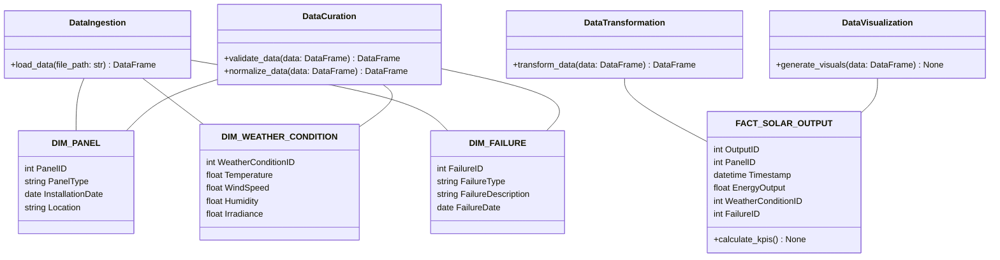

# Technical Design Document for Local Solar Panel BI Dashboard ETL Pipeline

## HighLevelSystemDesign

The solution architecture is designed for local execution, leveraging Python and its libraries such as pandas for data manipulation and Plotly for interactive visualizations. The application will consist of a series of Python classes that encapsulate the functionality for data ingestion, curation, transformation, and visualization.

## DataIngestion

The DataIngestion class will be responsible for loading the solar sensor data from the local CSV file using pandas. It will read the data into a pandas DataFrame for further processing.

## DataCuration

The DataCuration class will perform data validation and normalization on the ingested data. It will ensure that there are no missing or corrupt values and that the data is consistent. The curated data will be stored in a pandas DataFrame.

## DataTransformation

The DataTransformation class will apply business logic to calculate the KPIs defined in the requirements document. It will transform the curated data into the format specified by the logical data model, using classes that represent the fact and dimension tables.

## DataVisualization

The DataVisualization class will use the transformed data to generate the required visualizations such as time series graphs, heatmaps, pie charts, and scatter plots using Plotly. These visualizations will be interactive and can be viewed in a web browser.

## Orchestration

The orchestration of the ETL pipeline will be managed by a main driver script that sequentially executes the methods of the DataIngestion, DataCuration, DataTransformation, and DataVisualization classes. Error handling will be implemented to log and manage any issues that arise during execution.

## ClassDiagrams

## ProgramFlow

